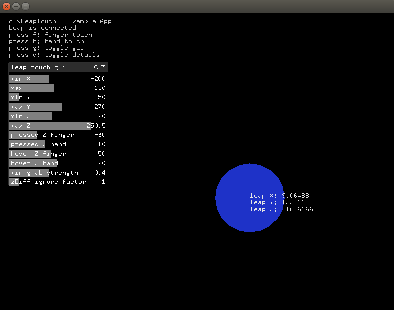

ofxLeapTouch2
================

*This is a modified version of the ofxLeapTouch addon, which can be found here: https://github.com/ixds/ofxLeapTouch. This addon utilizes ofxLeapMotion2 instead and adds some additional functionality.*

ofxLeapTouch is an [openFrameworks](https://github.com/openframeworks/openFrameworks) addon to use the [Leap Motion](https://leapmotion.com) as a Touchless-Touch controller. After setting up a mid-air "touch" sensitive area near your screen, ofxLeapTouch interprets interactions in this field like a touch pad and sends basic openFrameworks touch events accordingly. Due to the use of these [core events](http://openframeworks.cc/documentation/events/ofCoreEvents.html), combining it with touch reactive user interfaces should be straightforward. 

Touchless-Touch is NOT the next step/level for interacting with systems (mainly because of the missing haptical feedback) but it has its advantages (like hover/subtle states) and ofxLeapTouch helps exploring ideas in this field more quickly.

Features 
--------

* Setup for leap-to-screen mapping (touchless touch area)
* Emits `ofTouchEvents` according to finger/hand interactions
* Works with fingers and/or hands (check `enum leapTouchMode`)
* Addional events to work with hover/subtle states 
* Distance to screen (z-Axis) is interpreted as touch pressure

Examples
--------

### example-basics

Small example with debug draw of fingers (red) or hands (blue). Depending on the leap Z position each finger/hand has the state **subtle** (grey), **hovering** (transparent) or **pressed** (non-transparent).

Setup
------

* ofxLeapTouch2 is built upon top of [ofxLeapMotion2](https://github.com/genekogan/ofxLeapMotion2). Please follow the install instructions there and run the basic example before you continue.
* If you want to setup your own project, you need to make sure libLeap.dylib is copied to the bin directory
  * ibn xcode: go to buid phases -> copy files and add addons/ofxLeapMotion2/libs/lib/osx/libLeap.dylib with destination "products directory"

Dependencies
------------

* [ofxLeapMotion2](https://github.com/genekogan/ofxLeapMotion2)
* ofxGui (part of the oF core)
